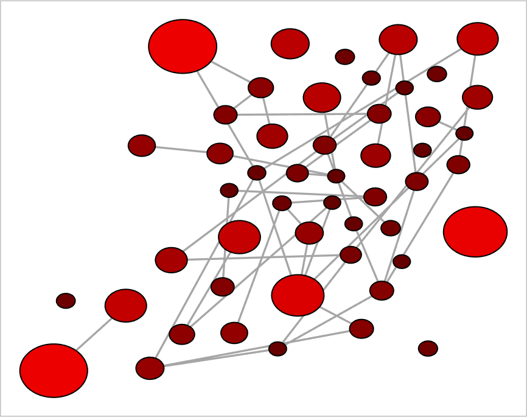
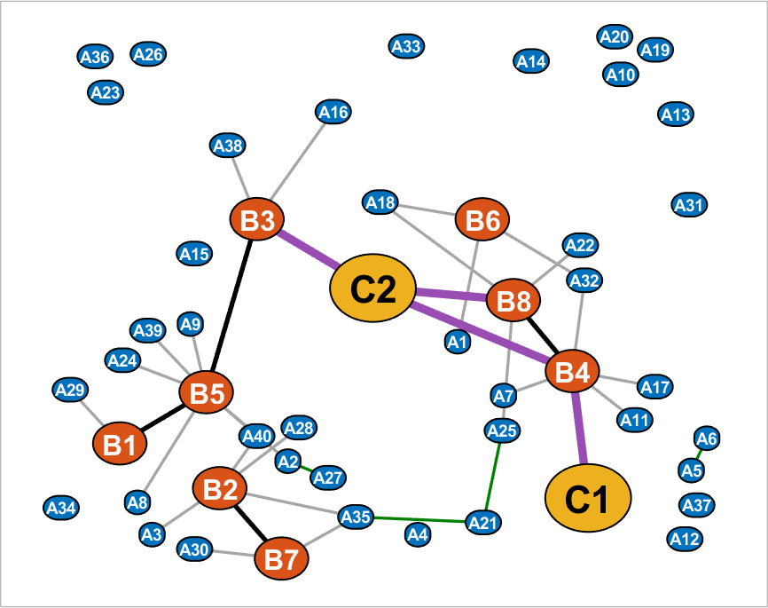
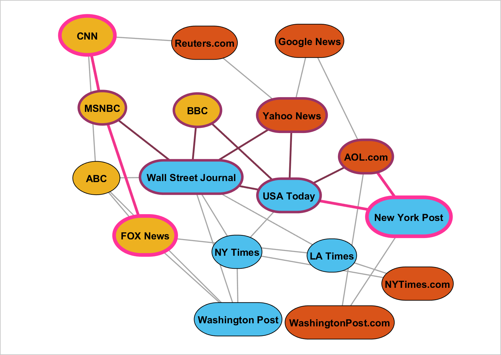
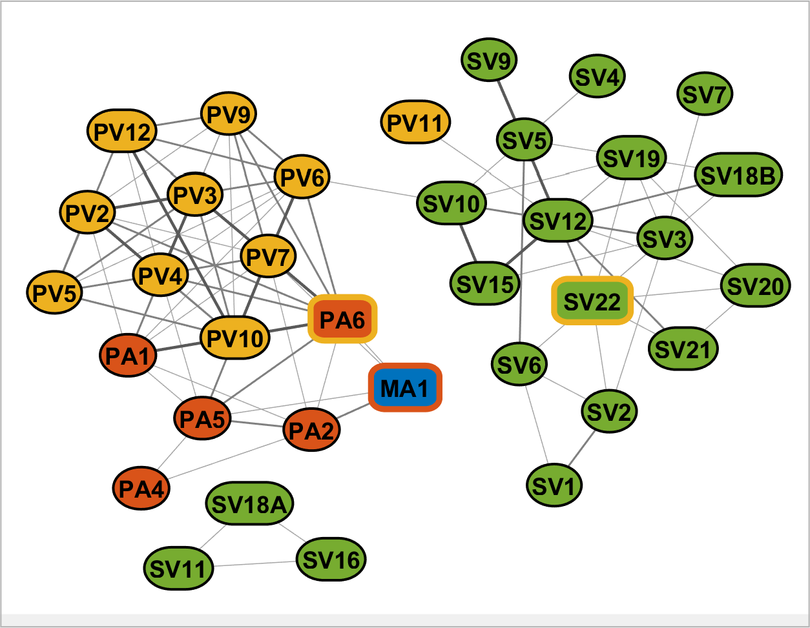
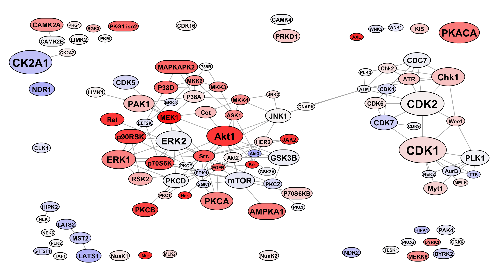

## NetworkVisualizer (graph visualization library)
<em>Effortlessly create visually appealing network figures with customizable node/edge properties and support for heterogeneous graphs. </em>

[Matlab Central page](https://www.mathworks.com/matlabcentral/fileexchange/129854-networkvisualizer-graph-visualization-library), [Help page](https://serhan-yilmaz.github.io/networkvisualizer/docs/index.html)

## Description 
NetworkVisualizer is a graph visualization library designed for Matlab. It provides a convenient and highly customizable way to create network/graph figures, especially for bioinformatics or biomedical networks such as protein-protein interactions (PPI). The library is particularly useful for heterogeneous networks with variable node sizes and prevents node overlaps. It is designed with small to moderate-sized networks ranging from 50 to 200 nodes in mind. 

The library is inspired by the ggplot2 library in R and utilizes a similar customization system. This allows users to easily modify the appearance and style of the generated graphs.

Some of the key features of NetworkVisualizer include:
* <b> Support for variable node sizes</b>: The library adapts the Fruchterman-Reingold algorithm to prevent node overlaps and accommodate networks with different node sizes.
* <b> Customizable node/edge properties</b>: Users have the flexibility to customize various properties such as labels, colors, line widths, line colors, font sizes, and curvatures for nodes, as well as line widths and colors for the edges. This allows for personalized visualizations that suit specific requirements.
* <b> Support for heterogeneous graphs with multiple node types</b>: NetworkVisualizer seamlessly handles graphs with multiple node types, allowing for the representation of complex network structures. Furthermore, it enables customization of node and edge properties based on the type of the node, providing the ability to tailor the visual representation to specific nodes in the graph.

With these features, NetworkVisualizer offers powerful tools for visualizing and analyzing various types of networks, enabling users to create visually appealing and publication-quality network figures that showcase their data in an engaging and informative manner. The provided flexibility and functionality to effectively explore and present network data can make it a valuable tool for researchers, analysts, and data scientists. 

<em> Please note that the current version of NetworkVisualizer supports only undirected graphs. </em>

## Getting Started
### Examples
```Matlab
rng(1, 'twister'); % For reproducibility
% Generate a random network with 50 nodes and 100 edges
nNode = 50;
prepareRandomNetwork = @(n1, n2, numedges) logical(sparse(...
   randi([1 n1], numedges, 1), randi([1 n2], numedges, 1), 1, n1, n2));
W = prepareRandomNetwork(nNode, nNode, 100);
% Set the nodeSizes randomly and create the networkvisualizer object
nodeSizes = 4 + exprnd(3, nNode, 1);
net = networkvisualizer(W, nodeSizes);
% Plot the network
figure(1); plot(net);
```
#### Apply Quantitative Coloring
```
% Apply sigmoid function to get a coefficient between 0 and 1 for each node
applySigmoid = @(x, k) 2 ./ (1 + exp(-x/k)) - 1;
% Coeff are normalized scores based on nodeSizes
coeff = applySigmoid(nodeSizes, 5);
% Set a color for each node between black (0) and red (1) based on coeff
nodeColors = color_spacing_continuous(coeff, [0 1], [0 0 0; 1 0 0]);
net = setNodeColors(net, nodeColors);
% Draw the network again
figure(1); plot(net);
```

### Example with Multiple Node Types
```
rng(1, 'twister'); % For reproducibility
% Initialize the constructor for networkvisualizer
net = networkvisualizer_c();
% Add 40 nodes of type A, 8 nodes of type B, and 2 nodes of type C
nNodeA = 40; nNodeB = 8; nNodeC = 2;
net.addNodes({nNodeA, nNodeB, nNodeC}, {'A', 'B', 'C'});
% Prepare a random network between type A and type B with 30 edges
prepareRandomNetwork = @(n1, n2, numedges) logical(sparse(...
   randi([1 n1], numedges, 1), randi([1 n2], numedges, 1), 1, n1, n2));
Wa2b = prepareRandomNetwork(nNodeA, nNodeB, 30);
% Prepare random networks for edges between A-A, B-B and B-C node types
Wb2b = prepareRandomNetwork(nNodeB, nNodeB, 10);
Wa2a = prepareRandomNetwork(nNodeA, nNodeA, 10);
Wb2c = prepareRandomNetwork(nNodeB, nNodeC, 5);
% Add the generated edges to the network
net.addEdges({Wa2a, Wb2b, Wa2b, Wb2c}, {'A-A', 'B-B', 'A-B', 'B-C'});
% Construct the networkvisualizer object
net = net.construct();
% Set the node sizes based on types A, B and C
net.setNodeSizes([3; 7.5; 12], {'A'; 'B'; 'C'});
% Run the layout algorithm again to apply the changes in nodeSizes
net.dolayout();
% Set line widths for all edges between B-B and B-C pairs to 2 and 3.5
net.setEdgeLineWidth([2; 3.5], {'B-B', 'B-C'});
% Set the edges colors for edges between B-B, A-A and B-C pairs
net.setEdgeColors({[0 0 0], [0 0.5 0], [0.6 0.3 0.7]}, {'B-B', 'A-A', 'B-C'});
% Draw the network 
figure(1); plot(net);
```
#### Add labels to each node
```
% Generate labels for each node A1...An, B1...Bm, C1...Ck etc.
generateLabels = @(type, n) arrayfun(@(x) [type, num2str(x)], 1:n, 'UniformOutput', false);
labelsA = generateLabels('A', nNodeA);
labelsB = generateLabels('B', nNodeB);
labelsC = generateLabels('C', nNodeC);
% Apply the generated labels for each node type A, B and C
net.setNodeLabels({labelsA labelsB, labelsC}, {'A', 'B', 'C'});
% Set the label colors for nodes of type A and B to white
net.setNodeLabelColor([1 1 1]*0.98, {'A', 'B'});
% Set the font sizes based on the type of the node
net.setNodeFontSize([7; 12; 16], {'A', 'B', 'C'});
% Set node sizes to 'auto' to accommodate labels if necessary
net.setNodeSizes('auto');
% Draw the network again
figure(1); plot(net);
```

### Output Figures



## Documentation
For more detailed information, see the [documentation](https://serhan-yilmaz.github.io/networkvisualizer/docs/networkvisualizer.html).

## Tutorial
For instructions on how to generate a highly customized figure like the one below, see the [tutorial document](tutorial.pdf) and the corresponding [script](demo_media_network.m).



## Demos
Here are some network visualizations that are generated with this library as well as their source code. 

### Demo 1: Questionnaire Association Network
See the [demo 1 script](demo_survey_association.m) which produces:



### Demo 2: Kinase Protein-Protein Interaction (PPI) Network
See the [demo 2 script](demos/demo_kinase_ppi.m) which produces:

