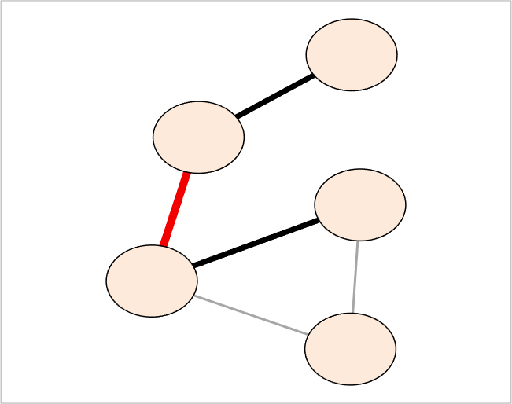

## addEdgeClass (networkvisualizer)
Adds a new edge class for a networkvisualizer object.

### Syntax
```Matlab
net = addEdgeClass(net, categories, classname)
```

### Arguments
* ```net```: Networkvisualizer object created with function [networkvisualizer](networkvisualizer.md).
* ```categories```: A vector specifying the class categories for each edge
* ```classname```: A string that specifies the name of the new class to be added

### Description
* ```net = addEdgeClass(net, categories, classname)``` adds a new class named ```classname``` to the network, setting the category of each edge ```i``` to ```categories(i)```. The added class can be used to specify the edges while setting up various edge properties such as [Line Width](setEdgeLineWidth.md) and [Edge Colors](setEdgeColors.md). Note that, the edge categories should be listed in the exact same order as they appear in ```net.EdgeList``` or ```net.Edges```. 

### Examples

#### Adding an edge class

```Matlab
rng(1, 'twister'); % For reproducibility
W = [0 1 1 0 0;1 0 0 1 1;1 0 0 0 0;0 0 0 0 1;1 0 1 0 0];
labels ={'A', 'B', 'C', 'D', 'E'}';
net = networkvisualizer(W);
% Add a randomized edge category having 1, 2 and 3 as values
edge_categories = randi([1 3], length(net.Edges), 1);
net.addEdgeClass(edge_categories, 'EdgeCategory');
% Set the edge colors and line widths based on the edge category
net.setEdgeColors([0 0 1; 0 0 0], [2; 3], 'EdgeCategory');
net.setEdgeLineWidth({1.5, 5, 3.5}, {1, 2, 3}, 'EdgeCategory');
plot(net);
```
which produces:




### See Also
[networkvisualizer](networkvisualizer.md), [addNodeClass](addNodeClass.md), [createEdgeClass](createEdgeClass.md), [setEdgeLineWidth](setEdgeLineWidth.md), [setEdgeColors](setEdgeColors.md), [setEdgeLineStyle](setEdgeLineStyle.md)
