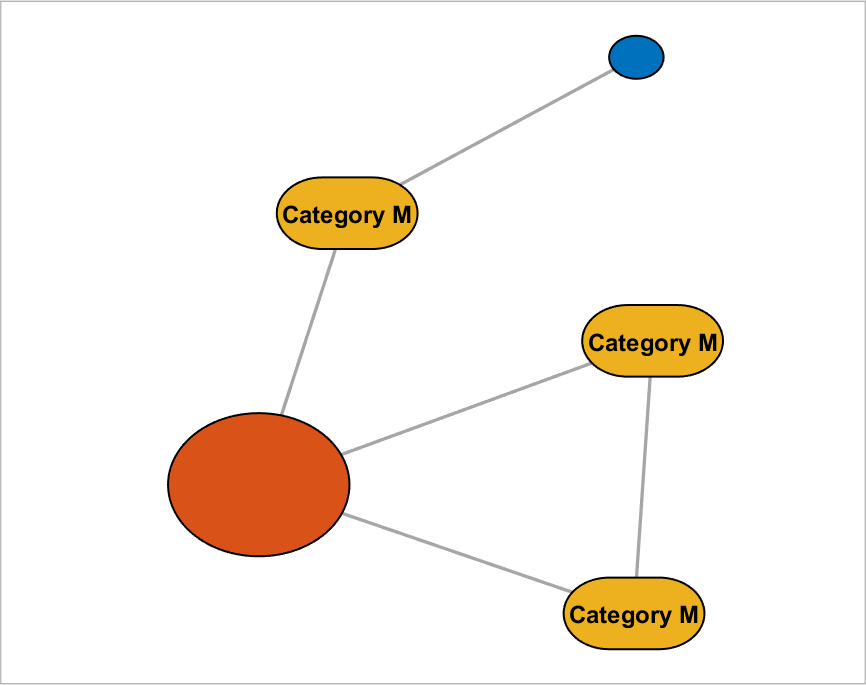

## addNodeClass (networkvisualizer)
Adds a new node class for a networkvisualizer object.

### Syntax
```Matlab
net = addNodeClass(net, categories, classname)
```

### Arguments
* ```net```: Networkvisualizer object created with function [networkvisualizer](networkvisualizer.md).
* ```categories```: A vector of length n specifying the class categories for each node
* ```classname```: A string that specifies the name of the new class to be added

### Description
* ```net = addNodeClass(net, categories, classname)``` adds a new class named ```classname``` to the network, setting the category of each node ```i``` to ```categories(i)```. The added class can be used to specify the nodes while setting up various node properties such as [Node Sizes](setNodeSizes.md) and [Node Colors](setNodeColors.md). Note that, if this is the first node class to be added and if node colors are not set already, the coloring of nodes is performed automatically according to the category of each node based on default colors. 

### Examples

#### Adding a node class

```Matlab
rng(1, 'twister'); % For reproducibility
W = [0 1 1 0 0;1 0 0 1 1;1 0 0 0 0;0 0 0 0 1;1 0 1 0 0];
categories = {'M', 'L', 'K', 'M', 'M'}';
net = networkvisualizer(W);
net.addNodeClass(categories);
plot(net);
```
which produces:


#### Updating the node sizes and labels based on the node class

```Matlab
% Set the node labels of category M to 'Category M'
net.setNodeLabels('Category M', 'M');
% Set the node sizes of M, K and L categories to 10, 6 and 20
net.setNodeSizes({10, 6, 20}, {'M', 'K', 'L'});
% Enabled automatic resizing to ensure labels are within the node borders
net.setNodeSizes('auto');
plot(net);
```
which produces:



#### Add an additional weight class and set line widths 

```Matlab
% Add a new node class named Weight
weight_class = {'high', 'high', 'low', 'low', 'low'};
net.addNodeClass(weight_class, 'Weight');
% Set the node line width of 'high' category of 'Weight' class to 3
net.setNodeLineWidth(3, 'high', 'Weight');
plot(net);
```
which produces:


### See Also
[networkvisualizer](networkvisualizer.md), [addEdgeClass](addEdgeClass.md), [createEdgeClass](createEdgeClass.md), [setNodeSizes](setNodeSizes.md), [setNodeColors](setNodeColors.md), [setNodeLabels](setNodeLabels.md), [setNodeLabelColor](setNodeLabelColor.md), [setNodeLineWidth](setNodeLineWidth.md), [setNodeLineStyle](setNodeLineStyle.md), [setNodeFontSize](setNodeFontSize.md), [setNodeLineColor](setNodeLineColor.md), [setNodeCurvature](setNodeCurvature.md)


