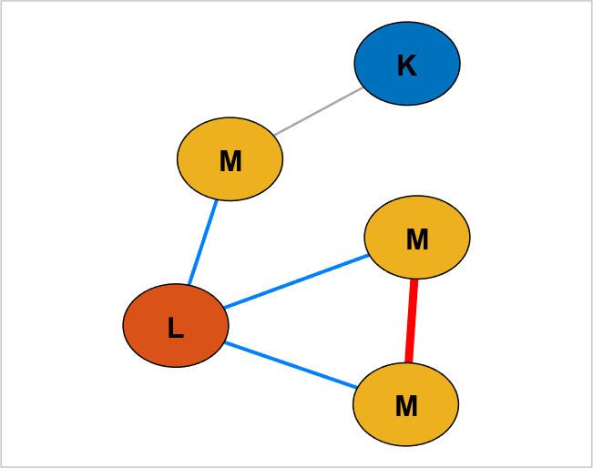
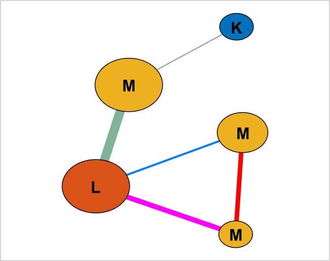

## createEdgeClass (networkvisualizer)
Creates a new edge class for a networkvisualizer object.

### Syntax
```Matlab
net = createEdgeClass(net, name, nodeclass)
net = createEdgeClass(net, name, categories1, categories2, nodeclass)
net = createEdgeClass(net, name, categories1, categories2, nodeclass1, nodeclass2)
```

### Arguments
* ```net```: Networkvisualizer object created with function [networkvisualizer](networkvisualizer.md).
* ```name```: A string that specifies the name of the new edge class to be added
* ```nodeclass```: The name of the node class to be used
* ```categories```: A vector specifying the desired node class categories

### Description
* ```net = createEdgeClass(net, name, nodeclass)``` creates a new edge class named ```name``` based on the node categories for the class specified by ```nodeclass```. In the newly created class, the edge category of ```(i, j)``` is given by ```[cat[i]-cat[j]]``` where ```cat``` is a vector specifying the categories of each node for ```nodeclass```. To illustrate, suppose the node class has categories ```A```, ```B```, and ```C```. The resulting edge class will include categories ```[A-A, A-B, A-C, B-B, C-C]```. This means that an edge between categories ```A``` and ```B``` will have an edge category of ```A-B```. It's important to note that the categories are sorted alphabetically in descending order. Consequently, the edge category between ```B``` and ```A``` will still be named ```A-B```, preserving the alphabetical order convention.
* ```net = createEdgeClass(net, name, categories1, categories2, nodeclass)``` creates a new edge class named ```name``` to the network, setting the category of each edge ```(i, j)``` to either true or false. An edge ```(i, j)``` will have true value only if categories of ```i``` and ```j``` for ```nodeclass``` are specified within ```categories1``` and ```categories2``` respectively. 
* ```net = createEdgeClass(net, name, categories1, categories2, nodeclass1, nodeclass2)``` creates an edge category based on different node classes such that ```categories1``` and ```categories2``` correspond to ```nodeclass1``` and ```nodeclass2``` respectively.
* Note that, regardless of how it is created, the edge classes can be used to specify a subset of edges while setting up various edge properties such as [Line Width](setEdgeLineWidth.md) and [Edge Colors](setEdgeColors.md). 
### Examples

#### Creating edge categories based on a given node class

```Matlab
rng(1, 'twister'); % For reproducibility
W = [0 1 1 0 0;1 0 0 1 1;1 0 0 0 0;0 0 0 0 1;1 0 1 0 0];
net = networkvisualizer(W);
labels = {'A', 'B', 'C', 'D', 'E'}';
categories = {'M', 'L', 'K', 'M', 'M'}';
net.addNodeClass(categories, 'NodeCategory');
net.setNodeLabels(categories);
net.setNodeFontSize(16);
% Create an edge class based on 'NodeCategory' class
net.createEdgeClass('EdgeCategory', 'NodeCategory');
% Set the edge colors and line widths based on the new edge class
net.setEdgeColors([1 0 0; 0 0.5 1], {'M-M', 'L-M'}, 'EdgeCategory');
net.setEdgeLineWidth({4.5, 2}, {'M-M', 'L-M'}, 'EdgeCategory');
plot(net);
```
which produces:



#### Creating edge categories based on different node classes

```Matlab
size_category = {'big', 'big', 'small', 'small', 'medium'};
net.addNodeClass(size_category, 'NodeSize');
% Resize the nodes based on their 'NodeSize' categories
net.setNodeSizes({20 15 10}, {'big', 'medium', 'small'}, 'NodeSize');
% Create an edge class between 'big' nodes
net.createEdgeClass('big-big', 'big', 'big', 'NodeSize');
% Create an edge class between 'small' and category 'L' nodes
net.createEdgeClass('small-L', 'small', 'L', 'NodeSize', 'NodeCategory');
% Set color of 'small-L' edges as purple and 'big-big' edges as dark green
net.setEdgeColors({[1 0 1] [0.5 0.7 0.6]}, {true, true}, {'small-L', 'big-big'});
% Set line width of 'small-L' edges as 5 and 'big-big' edges as 9
net.setEdgeLineWidth({5 9}, {true, true}, {'small-L', 'big-big'});
plot(net);
```
which produces:



### See Also
[networkvisualizer](networkvisualizer.md), [addNodeClass](addNodeClass.md), [addEdgeClass](addEdgeClass.md), [setEdgeLineWidth](setEdgeLineWidth.md), [setEdgeColors](setEdgeColors.md), [setEdgeLineStyle](setEdgeLineStyle.md)
