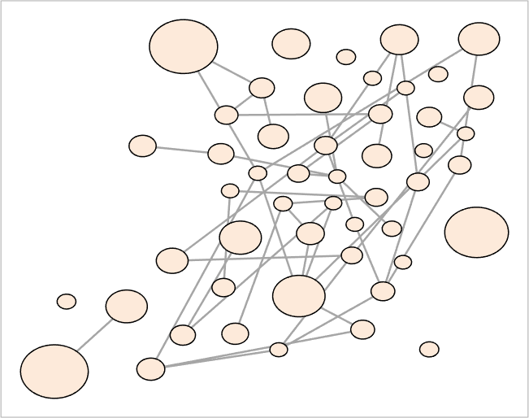
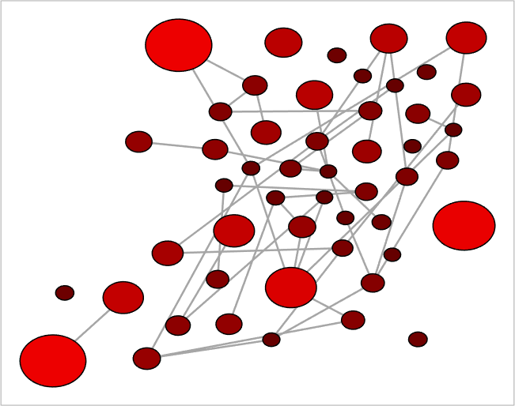

## networkvisualizer
Initializes the networkvisualizer object from the given network

### Syntax
```Matlab
net = networkvisualizer(W)
net = networkvisualizer(W, k)
net = networkvisualizer(W, sizes)
```

### Arguments
* ```W```: A sparse matrix of size n x n specifying the network
* ```k```: A scalar value specifying the size of all nodes
* ```sizes```: A vector of length n specifying the size of each node

### Description
* ```net = networkvisualizer(W)``` creates a networkvisualizer from the given network ```W```. 
* ```net = networkvisualizer(W, k)``` additionally sets the sizes of every node to ```k```. 
* ```net = networkvisualizer(W, sizes)``` sets the node sizes of every node ```i``` to the size provided in ```sizes{i}```. Thus, the ```sizes``` should be a vector of length equal to the number of nodes. 

### Examples

#### Setting the node labels

```Matlab
rng(1, 'twister'); % For reproducibility
% Generate a random network with 50 nodes and 100 edges
nNode = 50;
prepareRandomNetwork = @(n1, n2, numedges) logical(sparse(...
   randi([1 n1], numedges, 1), randi([1 n2], numedges, 1), 1, n1, n2));
W = prepareRandomNetwork(nNode, nNode, 100);
% Set the nodeSizes randomly and create the networkvisualizer object
nodeSizes = 4 + exprnd(3, nNode, 1);
net = networkvisualizer(W, nodeSizes);
% Plot the network
plot(net);
```
which produces:



#### Updating labels using node classes

```Matlab
% Apply sigmoid function to get a coefficient between 0 and 1 for each node
applySigmoid = @(x, k) 2 ./ (1 + exp(-x/k)) - 1;
% Coeff are normalized scores based on nodeSizes
coeff = applySigmoid(nodeSizes, 5);
% Set a color for each node between black (0) and red (1) based on coeff
nodeColors = color_spacing_continuous(coeff, [0 1], [0 0 0; 1 0 0]);
net = setNodeColors(net, nodeColors);
% Draw the network again
plot(net);
```
which produces:



### See Also
[sparse](https://www.mathworks.com/help/matlab/ref/sparse.html), [addNodeClass](addNodeClass.md), [addEdgeClass](addEdgeClass.md), [createEdgeClass](createEdgeClass.md), [setNodeLabels](setNodeLabels.md), [setNodeColors](setNodeColors.md), [setNodeSizes](setNodeSizes.md)


