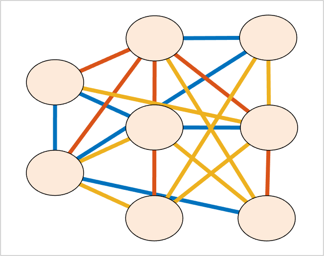
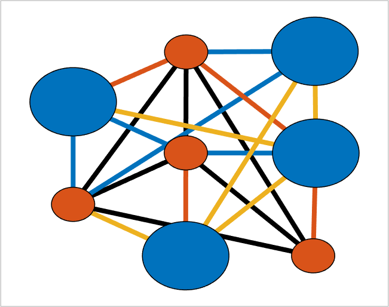

## setEdgeColors (networkvisualizer)
Set the edge colors of a networkvisualizer object.

### Syntax
```Matlab
net = setEdgeColors(net, RGB)
net = setEdgeColors(net, values)
net = setEdgeColors(net, values, categories)
net = setEdgeColors(net, values, categories, classname)
```

### Arguments
* ```net```: Networkvisualizer object created with function [networkvisualizer](networkvisualizer.md).
* ```RGB```: A RGB triplet specifying the color of all edges.
* ```values```: A vector of RGB triplets or a cell array containing the edge colors to be set.
* ```categories```: A vector specifying the edge categories which the modifications will apply.
* ```classname```: A string that specifies which edge class the given ```categories``` correspond to.

### Description
* ```net = setEdgeColors(net, RGB)``` sets the color of all edges to ```RGB```.
* ```net = setEdgeColors(net, values)``` sets the edge colors of every edge ```i``` to the color provided in ```values(i, :)```. Thus, the ```values``` should be a matrix of size m x 3 where m is equal to the number of edges. Note that, the edges corresponding to ```values``` should be in the exact same order as they appear in ```net.EdgeList``` or ```net.Edges```.
* ```net = setEdgeColors(net, values, categories)``` uses the node class categories in ```categories``` to specify which nodes to be resized. For example, ```setEdgeColors(net, {[1 0 0], [0 0 1]}, {'A-A', 'A=B'})``` sets the colors of edges with category ```'A-A'``` to red and edges with category ```'A-B'``` to blue. This type of specification allows conditional formatting of edge with respect to the categories provided. By default, it is assumed that the categories correspond to the first edge class added by the [addEdgeClass](addEdgeClass.md) or [createEdgeClass](createEdgeClass.md) functions.
* ```net = setEdgeColors(net, values, categories, classname)``` uses the edge class with name ```classname``` for the provided categories.

### Examples

#### Set the edge colors randomly to one of default colors

```Matlab
rng(1, 'twister'); % For reproducibility
% Generate a random network with 50 nodes and 100 edges
nNode = 8;
prepareRandomNetwork = @(n1, n2, numedges) logical(sparse(...
   randi([1 n1], numedges, 1), randi([1 n2], numedges, 1), 1, n1, n2));
W = prepareRandomNetwork(nNode, nNode, 100);
net = networkvisualizer(W);
net.setEdgeLineWidth(4);
% Set the node colors randomly to one of default colors
defaultcolors = net.getDefaultColors();
colors = defaultcolors(randi([1 3], length(net.Edges), 1), :);
net.setEdgeColors(colors);
% Plot the network
plot(net);
```
which produces:



#### Set the edge colors based on edge categories

```Matlab
size_values = randi([1 2], nNode, 1);
size_cats = {'small', 'big'};
net.addNodeClass(size_cats(size_values), 'NodeSize');
net.setNodeSizes({10, 20}, {'small', 'big'}, 'NodeSize');
% Create an edge class based on 'NodeSize' categories
net.createEdgeClass('EdgeCategory', 'NodeSize')
% Set the color of edges between small nodes as black
net = setEdgeColors(net, [0 0 0], 'small-small', 'EdgeCategory');
% Plot the network
plot(net);
```
which produces:



### See Also
[networkvisualizer](networkvisualizer.md), [addNodeClass](addNodeClass.md), [addEdgeClass](addEdgeClass.md), [createEdgeClass](createEdgeClass.md), [setNodeSizes](setNodeSizes.md), [setEdgeLineWidth](setEdgeLineWidth.md), [setEdgeLineStyle](setEdgeLineStyle.md)


