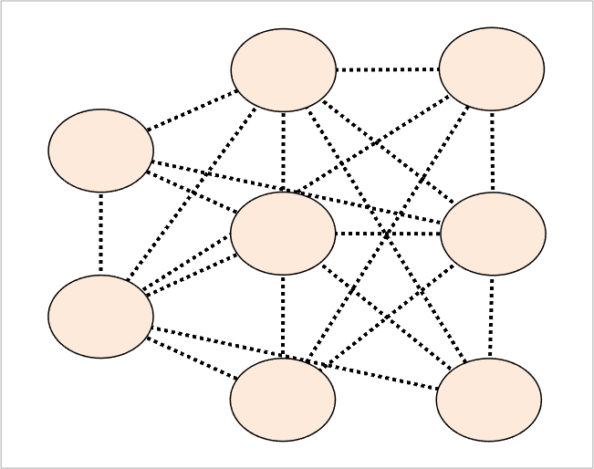

## setEdgeLineStyle (networkvisualizer)
Set the line style of edges for a given networkvisualizer object.

### Syntax
```Matlab
net = setEdgeLineStyle(net, style)
net = setEdgeLineStyle(net, values)
net = setEdgeLineStyle(net, values, categories)
net = setEdgeLineStyle(net, values, categories, classname)
```

### Arguments
* ```net```: Networkvisualizer object created with function [networkvisualizer](networkvisualizer.md).
* ```style```: A scalar value specifying the line style of all edges.
* ```values```: A scalar value or a cell array containing the edge line style to be set.
* ```categories```: A vector specifying the edge categories which the modifications will apply.
* ```classname```: A string that specifies which edge class the given ```categories``` correspond to.

### Description
* ```net = setEdgeLineStyle(net, style)``` sets the line style of all edges according to ```style```. The valid values are ```-``` for solid, '--' for dashed, ':' for dotted, '-.' for dash-dotted, and 'none' for no line. 
* ```net = setEdgeLineStyle(net, values)``` sets the line style of every edge ```i``` to the line style provided in ```values{i}```. Thus, the ```values``` should be a vector of length equal to the number of edges. 
* ```net = setEdgeLineStyle(net, values, categories)``` uses the edge class categories in ```categories``` to specify which edges to be modified. For example, ```setEdgeLineStyle(net, {':', '--'}, {'A-A', 'A-B'})``` sets the line style of edges with category ```'A-A'``` to ```:``` and edges with category ```'A-B'``` to ```--```. This type of specification allows conditional formatting of edges with respect to the categories provided. By default, it is assumed that the categories correspond to the first edge class added by the [addEdgeClass](addEdgeClass.md) or [createEdgeClass](createEdgeClass.md) functions.
* ```net = setNodeLineWidth(net, values, categories, classname)``` uses the edge class with name ```classname``` for the provided categories.

### Examples

#### Setting the line style of all edges

```Matlab
rng(1, 'twister'); % For reproducibility
% Generate a random network with 50 nodes and 100 edges
nNode = 8;
prepareRandomNetwork = @(n1, n2, numedges) logical(sparse(...
   randi([1 n1], numedges, 1), randi([1 n2], numedges, 1), 1, n1, n2));
W = prepareRandomNetwork(nNode, nNode, 100);
net = networkvisualizer(W);
net.setEdgeColors([0 0 0]);
net.setEdgeLineWidth(2);
% Set the edge line style as dotted ':'
net.setEdgeLineStyle(':');
% Plot the network
plot(net);
```
which produces:



#### Updating line style of edges using classes

```Matlab
size_values = randi([1 2], nNode, 1);
size_cats = {'small', 'big'};
net.addNodeClass(size_cats(size_values), 'NodeSize');
net.setNodeSizes({10, 20}, {'small', 'big'}, 'NodeSize');
% Create an edge class based on 'NodeSize' categories
net.createEdgeClass('EdgeCategory', 'NodeSize')
% Set the style of edges between small nodes to '--' and big nodes to '-'
net = setEdgeLineStyle(net, {'--', '-'}, {'small-small', 'big-big'}, 'EdgeCategory');
plot(net);
```
which produces:


### See Also
[networkvisualizer](networkvisualizer.md), [addNodeClass](addNodeClass.md), [addEdgeClass](addEdgeClass.md), [createEdgeClass](createEdgeClass.md), [setNodeSizes](setNodeSizes.md), [setEdgeColors](setEdgeColors.md), [setEdgeLineWidth](setEdgeLineWidth.md)


