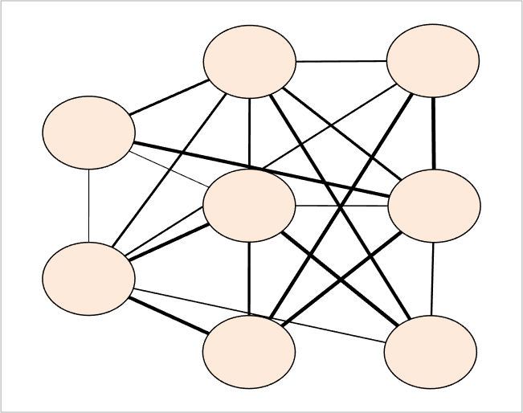
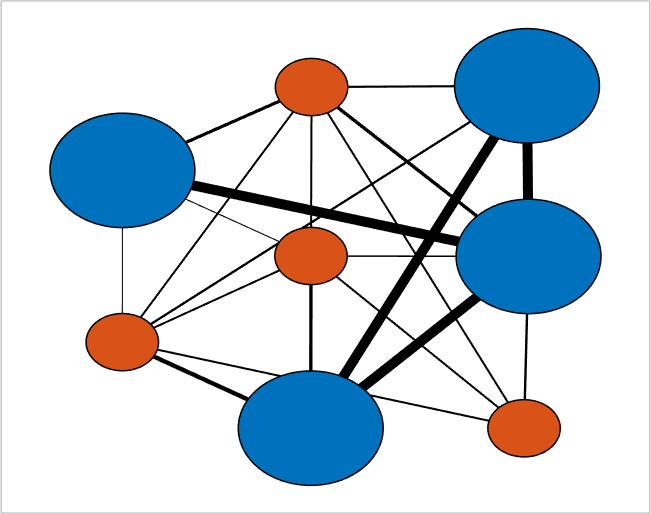

## setEdgeLineWidth (networkvisualizer)
Set the line width of edges for a given networkvisualizer object.

### Syntax
```Matlab
net = setEdgeLineWidth(net, k)
net = setEdgeLineWidth(net, values)
net = setEdgeLineWidth(net, values, categories)
net = setEdgeLineWidth(net, values, categories, classname)
```

### Arguments
* ```net```: Networkvisualizer object created with function [networkvisualizer](networkvisualizer.md).
* ```k```: A scalar value specifying the line width of all edges.
* ```values```: A scalar value or a cell array containing the edge line width to be set.
* ```categories```: A vector specifying the edge categories which the modifications will apply.
* ```classname```: A string that specifies which edge class the given ```categories``` correspond to.

### Description
* ```net = setEdgeLineWidth(net, k)``` sets the line width of all edges to ```k```.
* ```net = setEdgeLineWidth(net, values)``` sets the line width of every edge ```i``` to the line width provided in ```values{i}```. Thus, the ```values``` should be a vector of length equal to the number of edges. 
* ```net = setEdgeLineWidth(net, values, categories)``` uses the edge class categories in ```categories``` to specify which edges to be modified. For example, ```setEdgeLineWidth(net, {10, 12}, {'A-A', 'A-B'})``` sets the line width of edges with category ```'A-A'``` to 10 and edges with category ```'A-B'``` to 12. This type of specification allows conditional formatting of edges with respect to the categories provided. By default, it is assumed that the categories correspond to the first edge class added by the [addEdgeClass](addEdgeClass.md) or [createEdgeClass](createEdgeClass.md) functions.
* ```net = setNodeLineWidth(net, values, categories, classname)``` uses the edge class with name ```classname``` for the provided categories.

### Examples

#### Setting the node line widths

```Matlab
rng(1, 'twister'); % For reproducibility
% Generate a random network with 50 nodes and 100 edges
nNode = 8;
prepareRandomNetwork = @(n1, n2, numedges) logical(sparse(...
   randi([1 n1], numedges, 1), randi([1 n2], numedges, 1), 1, n1, n2));
W = prepareRandomNetwork(nNode, nNode, 100);
net = networkvisualizer(W);
net.setEdgeColors([0 0 0]);
% Set the edge line width randomly between [0.5 and 2.5]
width_values = 0.5 + 2 * rand(length(net.Edges), 1);
net.setEdgeLineWidth(width_values);
% Plot the network
plot(net);
```
which produces:



#### Updating node line widths using classes

```Matlab
size_values = randi([1 2], nNode, 1);
size_cats = {'small', 'big'};
net.addNodeClass(size_cats(size_values), 'NodeSize');
net.setNodeSizes({10, 20}, {'small', 'big'}, 'NodeSize');
% Create an edge class based on 'NodeSize' categories
net.createEdgeClass('EdgeCategory', 'NodeSize')
% Set the color of edges between small nodes to 1 and big nodes to 5
net = setEdgeLineWidth(net, {1, 5}, {'small-small', 'big-big'}, 'EdgeCategory');
plot(net);
%%
```
which produces:



### See Also
[networkvisualizer](networkvisualizer.md), [addNodeClass](addNodeClass.md), [addEdgeClass](addEdgeClass.md), [createEdgeClass](createEdgeClass.md), [setNodeSizes](setNodeSizes.md), [setEdgeColors](setEdgeColors.md), [setEdgeLineStyle](setEdgeLineStyle.md)


