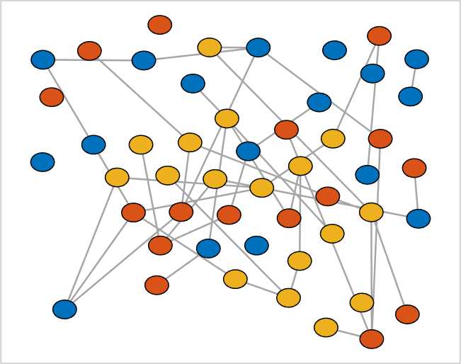
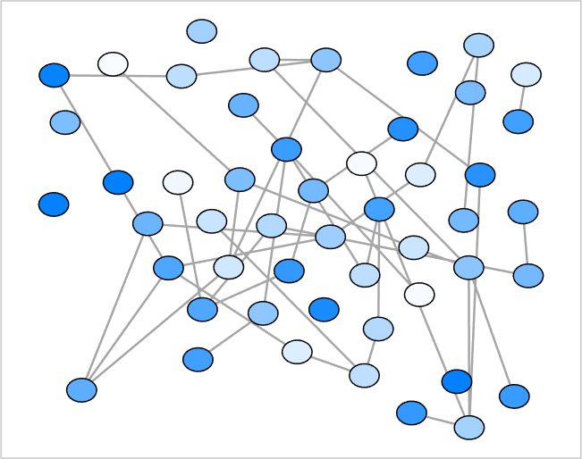

## setNodeColors (networkvisualizer)
Set the node colors of a networkvisualizer object.

### Syntax
```Matlab
net = setNodeColors(net, RGB)
net = setNodeColors(net, values)
net = setNodeColors(net, values, categories)
net = setNodeColors(net, values, categories, classname)
```

### Arguments
* ```net```: Networkvisualizer object created with function [networkvisualizer](networkvisualizer.md).
* ```RGB```: A RGB triplet specifying the color of all nodes.
* ```values```: A vector of RGB triplets or a cell array containing the node colors to be set.
* ```categories```: A vector specifying the class categories which the modifications will apply.
* ```classname```: A string that specifies which node class the given ```categories``` correspond to.

### Description
* ```net = setNodeColors(net, RGB)``` sets the color of all nodes to ```RGB```.
* ```net = setNodeColors(net, values)``` sets the node colors of every node ```i``` to the color provided in ```values(i, :)```. Thus, the ```values``` should be a matrix of size n x 3 where n is equal to the number of nodes. 
* ```net = setNodeColors(net, values, categories)``` uses the node class categories in ```categories``` to specify which nodes to be resized. For example, ```setNodeColors(net, {[1 0 0], [0 0 1]}, {'A', 'B'})``` sets the colors of nodes with category ```'A'``` to red and nodes with category ```'B'``` to blue. This type of specification allows conditional formatting of nodes with respect to the categories provided. By default, it is assumed that the categories correspond to the first node class added by the [addNodeClass](addNodeClass.md) function.
* ```net = setNodeColors(net, values, categories, classname)``` uses the node class with name ```classname``` for the provided categories.

### Examples

#### Set the node colors randomly to one of default colors

```Matlab
rng(1, 'twister'); % For reproducibility
% Generate a random network with 50 nodes and 100 edges
nNode = 50;
prepareRandomNetwork = @(n1, n2, numedges) logical(sparse(...
   randi([1 n1], numedges, 1), randi([1 n2], numedges, 1), 1, n1, n2));
W = prepareRandomNetwork(nNode, nNode, 100);
net = networkvisualizer(W);
% Set the node colors randomly to one of default colors
defaultcolors = net.getDefaultColors();
colors = defaultcolors(randi([1 3], nNode, 1), :);
net.setNodeColors(colors);
% Plot the network
plot(net);
```
which produces:



#### Apply quantitative coloring

```Matlab
% Set a random color for each node between white (0) and light blue (1)
nodeColors = color_spacing_continuous(rand(nNode, 1), [0 1], [1 1 1; 0 0.5 1]);
net = setNodeColors(net, nodeColors);
% Draw the network again
plot(net);
```
which produces:



### See Also
[networkvisualizer](networkvisualizer.md), [addNodeClass](addNodeClass.md), [setNodeLabels](setNodeLabels.md), [setNodeFontSize](setNodeFontSize.md)


