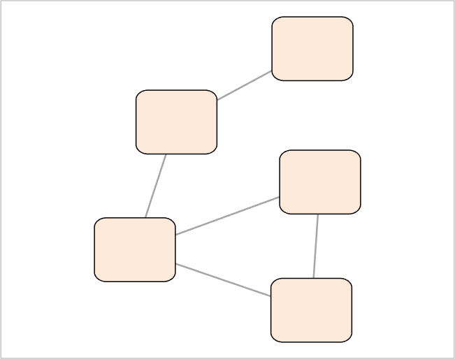
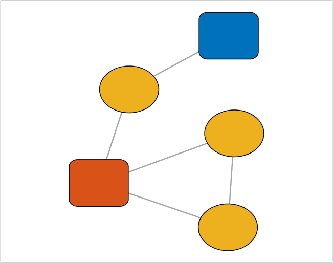

## setNodeCurvature (networkvisualizer)
Set the node curvatures for a networkvisualizer object.

### Syntax
```Matlab
net = setNodeCurvature(net, alpha)
net = setNodeCurvature(net, values)
net = setNodeCurvature(net, values, categories)
net = setNodeCurvature(net, values, categories, classname)
```

### Arguments
* ```net```: Networkvisualizer object created with function [networkvisualizer](networkvisualizer.md).
* ```alpha```: A scalar value between 0 and 1 specifying the curvature of all nodes.
* ```values```: A scalar value or a cell array containing the node curvatures to be set.
* ```categories```: A vector specifying the class categories which the modifications will apply.
* ```classname```: A string that specifies which node class the given ```categories``` correspond to.

### Description
* ```net = setNodeCurvature(net, alpha)``` sets the curvature of all node to ```alpha```. Values close to 0 result in a  rectangular shape, and values close to 1 result in a circular shape.
* ```net = setNodeCurvature(net, values)``` sets the curvatures of every node ```i``` to the value provided in ```values{i}```. Thus, the ```values``` should be a vector of length equal to the number of nodes. 
* ```net = setNodeCurvature(net, values, categories)``` uses the node class categories in ```categories``` to specify which nodes to be resized. For example, ```setNodeCurvature(net, {0, 1}, {'A', 'B'})``` sets the curvatures such that nodes with category ```'A'``` becomes rectangular (curvature 0) and nodes with category ```'B'``` becomes circular (curvature 1). This type of specification allows conditional formatting of nodes with respect to the categories provided. By default, it is assumed that the categories correspond to the first node class added by the [addNodeClass](addNodeClass.md) function.
* ```net = setNodeCurvature(net, values, categories, classname)``` uses the node class with name ```classname``` for the provided categories.

### Examples

#### Setting the node curvatures

```Matlab
rng(1, 'twister'); % For reproducibility
W = [0 1 1 0 0;1 0 0 1 1;1 0 0 0 0;0 0 0 0 1;1 0 1 0 0];
net = networkvisualizer(W);
net = setNodeCurvature(net, 0.3);
plot(net);
```
which produces:



#### Updating node curvatures based on classes

```Matlab
categories = {'M', 'L', 'K', 'M', 'M'}';
net = addNodeClass(net, categories);
net = setNodeCurvature(net, 1, 'M');
plot(net);
```
which produces:



### See Also
[networkvisualizer](networkvisualizer.md), [addNodeClass](addNodeClass.md), [setNodeColors](setNodeColors.md), [setNodeSizes](setNodeSizes.md)


