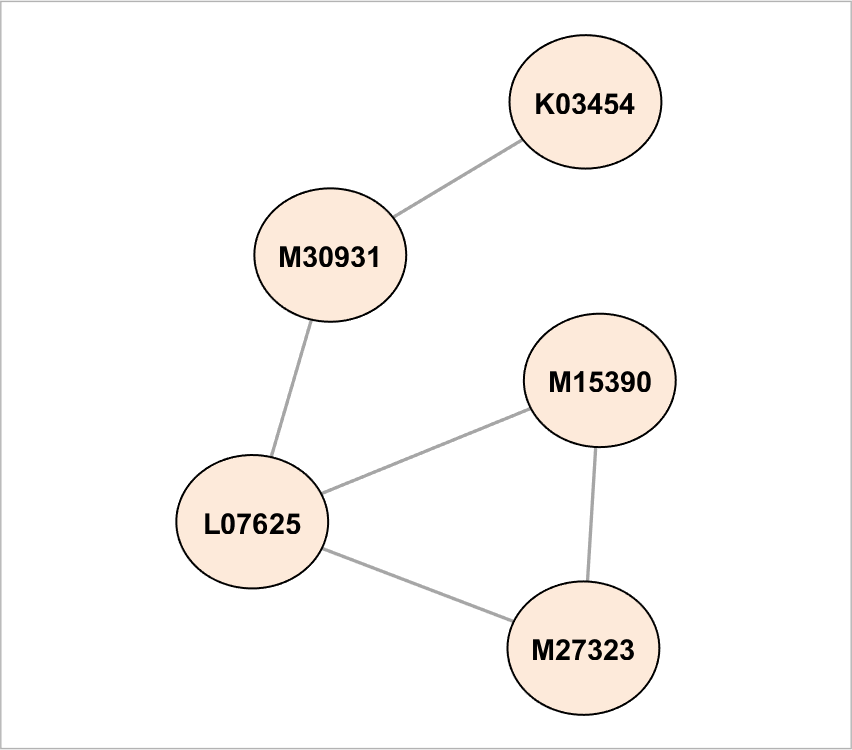
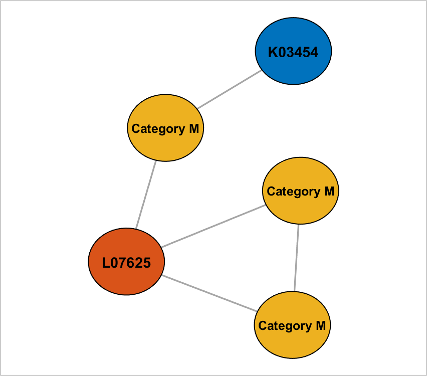

## setNodeFontSize (networkvisualizer)
Set the font size of node labels for a given networkvisualizer object.

### Syntax
```Matlab
net = setNodeFontSize(net, k)
net = setNodeFontSize(net, values)
net = setNodeFontSize(net, values, categories)
net = setNodeFontSize(net, values, categories, classname)
```

### Arguments
* ```net```: Networkvisualizer object created with function [networkvisualizer](networkvisualizer.md).
* ```k```: A scalar value specifying the font size of all node labels.
* ```values```: A vector specifying the font size of the node labels.
* ```categories```: A vector specifying the class categories which the modifications will apply.
* ```classname```: A string that specifies which node class the given ```categories``` correspond to.

### Description
* ```net = setNodeFontSize(net, k)``` sets the font size of all node labels to ```k```.
* ```net = setNodeFontSize(net, values)``` sets the font size of every node ```i``` to the value provided in ```values(i)```. Thus, the ```values``` should be a vector of length equal to the number of nodes. 
* ```net = setNodeFontSize(net, values, categories)``` uses the node class categories in ```categories``` to specify which nodes to be updated. For example, ```setNodeFontSize(net, {10, 12}, {'A', 'B'})``` sets the font size of nodes with category ```'A'``` to ```10``` and nodes with category ```'B'``` to ```'12```. This type of specification allows conditional formatting of nodes with respect to the categories provided. By default, it is assumed that the categories correspond to the first node class added by the [addNodeClass](addNodeClass.md) function.
* ```net = setNodeFontSize(net, values, categories, classname)``` uses the node class with name ```classname``` for the provided categories.

### Examples

#### Setting the node labels with a constant font size

```Matlab
rng(1, 'twister'); % For reproducibility
W = [0 1 1 0 0;1 0 0 1 1;1 0 0 0 0;0 0 0 0 1;1 0 1 0 0];
labels = {'M30931','L07625','K03454','M27323','M15390'};
net = networkvisualizer(W);
net = setNodeLabels(net, labels);
net = setNodeFontSize(net, 11);
plot(net);
```
which produces:



#### Updating using node classes

```Matlab
categories = {'M', 'L', 'K', 'M', 'M'}';
net = addNodeClass(net, categories);
net = setNodeLabels(net, {'Category M'}, 'M');
net = setNodeFontSize(net, 9.5, 'M');
```
which produces:



### See Also
[addNodeClass](addNodeClass.md), [setNodeLabels](setNodeLabels.md)


