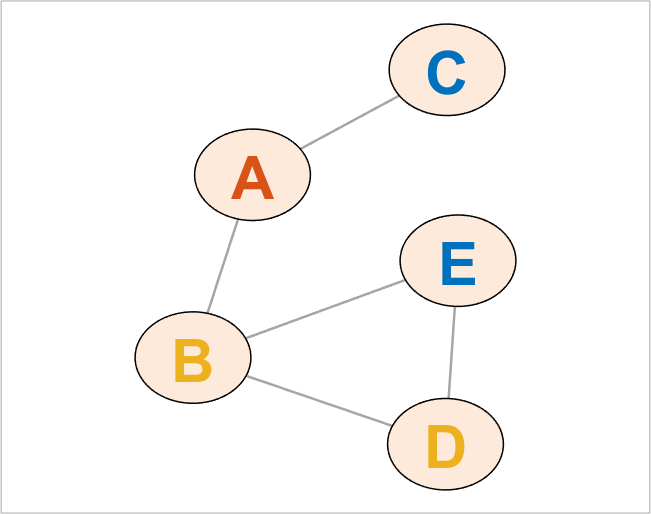

## setNodeLabelColor (networkvisualizer)
Set the node label colors for a networkvisualizer object.

### Syntax
```Matlab
net = setNodeLabelColor(net, RGB)
net = setNodeLabelColor(net, values)
net = setNodeLabelColor(net, values, categories)
net = setNodeLabelColor(net, values, categories, classname)
```

### Arguments
* ```net```: Networkvisualizer object created with function [networkvisualizer](networkvisualizer.md).
* ```RGB```: A RGB triplet specifying the label color of all nodes.
* ```values```: A vector of RGB triplets or a cell array containing the node label colors to be set.
* ```categories```: A vector specifying the class categories which the modifications will apply.
* ```classname```: A string that specifies which node class the given ```categories``` correspond to.

### Description
* ```net = setNodeLabelColor(net, RGB)``` sets the label color of all nodes to ```RGB```.
* ```net = setNodeLabelColor(net, values)``` sets the label color of every node ```i``` to the color provided in ```values(i, :)```. Thus, the ```values``` should be a matrix of size n x 3 where n is equal to the number of nodes. 
* ```net = setNodeLabelColor(net, values, categories)``` uses the node class categories in ```categories``` to specify which nodes to be resized. For example, ```setNodeLabelColor(net, {[1 0 0], [0 0 1]}, {'A', 'B'})``` sets the label colors of nodes with category ```'A'``` to red and nodes with category ```'B'``` to blue. This type of specification allows conditional formatting of nodes with respect to the categories provided. By default, it is assumed that the categories correspond to the first node class added by the [addNodeClass](addNodeClass.md) function.
* ```net = setNodeLabelColor(net, values, categories, classname)``` uses the node class with name ```classname``` for the provided categories.

### Examples

#### Setting the node labels and coloring them randomly

```Matlab
rng(1, 'twister'); % For reproducibility
W = [0 1 1 0 0;1 0 0 1 1;1 0 0 0 0;0 0 0 0 1;1 0 1 0 0];
labels = {'A', 'B', 'C', 'D', 'E'}';
net = networkvisualizer(W);
net.setNodeLabels(labels);
net.setNodeFontSize(30);
% Set the node label colors randomly to one of default colors
defaultcolors = net.getDefaultColors();
colors = defaultcolors(randi([1 3], length(W), 1), :);
net.setNodeLabelColor(colors);
% Plot the network
plot(net);
```
which produces:



### See Also
[networkvisualizer](networkvisualizer.md), [addNodeClass](addNodeClass.md), [setNodeLabels](setNodeLabels.md), [setNodeFontSize](setNodeFontSize.md)


