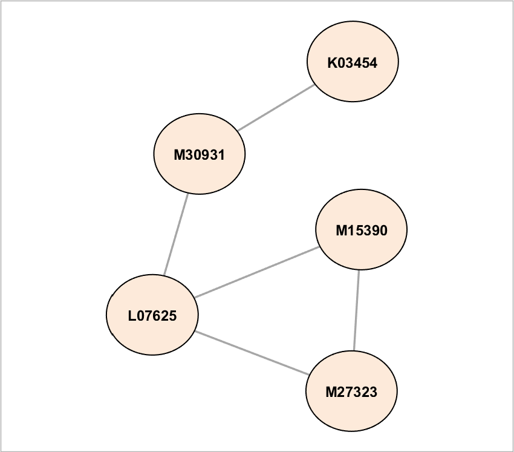
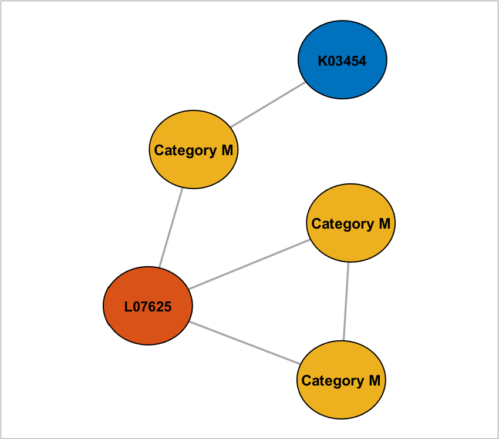

## setNodeLabels (networkvisualizer)
Set the node labels of a networkvisualizer object.

### Syntax
```Matlab
net = setNodeLabels(net, values)
net = setNodeLabels(net, values, categories)
net = setNodeLabels(net, values, categories, classname)
```

### Arguments
* ```net```: Networkvisualizer object created with function [networkvisualizer](networkvisualizer.md).
* ```values```: A cell array containing the node labels to be displayed.
* ```categories```: A vector specifying the class categories which the modifications will apply.
* ```classname```: A string that specifies which node class the given ```categories``` correspond to.

### Description
* ```net = setNodeLabels(net, values)``` sets the node label of every node ```i``` to the string provided in ```values{i}```. Thus, the ```values``` should be cell array of length equal to the number of nodes. 
* ```net = setNodeLabels(net, values, categories)``` uses the node class categories in ```categories``` to specify which nodes to be updated. For example, ```setNodeLabels(net, {'label1', 'label2'}, {'A', 'B'})``` sets the labels of nodes with category ```'A'``` to ```'label1'``` and nodes with category ```'B'``` to ```'label2'```. This type of specification allows conditional formatting of nodes with respect to the categories provided. By default, it is assumed that the categories correspond to the first node class added by the [addNodeClass](addNodeClass.md) function.
* ```net = setNodeLabels(net, values, categories, classname)``` uses the node class with name ```classname``` for the provided categories.

### Examples

#### Setting the node labels

```Matlab
rng(1, 'twister'); % For reproducibility
W = [0 1 1 0 0;1 0 0 1 1;1 0 0 0 0;0 0 0 0 1;1 0 1 0 0];
labels = {'M30931','L07625','K03454','M27323','M15390'};
net = networkvisualizer(W);
net = setNodeLabels(net, labels);
plot(net);
```
which produces:



#### Updating labels using node classes

```Matlab
categories = {'M', 'L', 'K', 'M', 'M'}';
net = addNodeClass(net, categories);
net = setNodeLabels(net, {'Category M'}, 'M');
net = setNodeFontSize(net, 9.5, 'M');
```
which produces:



### See Also
[addNodeClass](addNodeClass.md)


