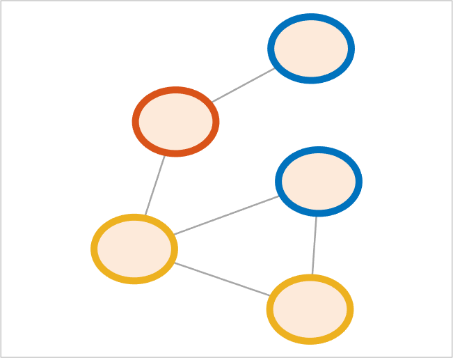

## setNodeLineColor (networkvisualizer)
Set the line colors of nodes for a networkvisualizer object.

### Syntax
```Matlab
net = setNodeLineColor(net, RGB)
net = setNodeLineColor(net, values)
net = setNodeLineColor(net, values, categories)
net = setNodeLineColor(net, values, categories, classname)
```

### Arguments
* ```net```: Networkvisualizer object created with function [networkvisualizer](networkvisualizer.md).
* ```RGB```: A RGB triplet specifying the line color of all nodes.
* ```values```: A vector of RGB triplets or a cell array containing the node line colors to be set.
* ```categories```: A vector specifying the class categories which the modifications will apply.
* ```classname```: A string that specifies which node class the given ```categories``` correspond to.

### Description
* ```net = setNodeLineColor(net, RGB)``` sets the line color of all nodes to ```RGB```.
* ```net = setNodeLineColor(net, values)``` sets the line colors of every node ```i``` to the color provided in ```values(i, :)```. Thus, the ```values``` should be a matrix of size n x 3 where n is equal to the number of nodes. 
* ```net = setNodeLineColor(net, values, categories)``` uses the node class categories in ```categories``` to specify which nodes to be resized. For example, ```setNodeLineColor(net, {[1 0 0], [0 0 1]}, {'A', 'B'})``` sets the line colors of nodes with category ```'A'``` to red and nodes with category ```'B'``` to blue. This type of specification allows conditional formatting of nodes with respect to the categories provided. By default, it is assumed that the categories correspond to the first node class added by the [addNodeClass](addNodeClass.md) function.
* ```net = setNodeLineColor(net, values, categories, classname)``` uses the node class with name ```classname``` for the provided categories.

### Examples

#### Setting the node line colors randomly

```Matlab
%% Run networkvisualizer on a random network
rng(1, 'twister'); % For reproducibility
W = [0 1 1 0 0;1 0 0 1 1;1 0 0 0 0;0 0 0 0 1;1 0 1 0 0];
net = networkvisualizer(W);
net.setNodeLineWidth(5);
% Set the node line colors randomly to one of default colors
defaultcolors = net.getDefaultColors();
colors = defaultcolors(randi([1 3], length(W), 1), :);
net.setNodeLineColor(colors);
% Plot the network
plot(net);
```
which produces:



### See Also
[networkvisualizer](networkvisualizer.md), [addNodeClass](addNodeClass.md), [setNodeLineWidth](setNodeLineWidth.md), [setNodeLineStyle](setNodeLineStyle.md)


