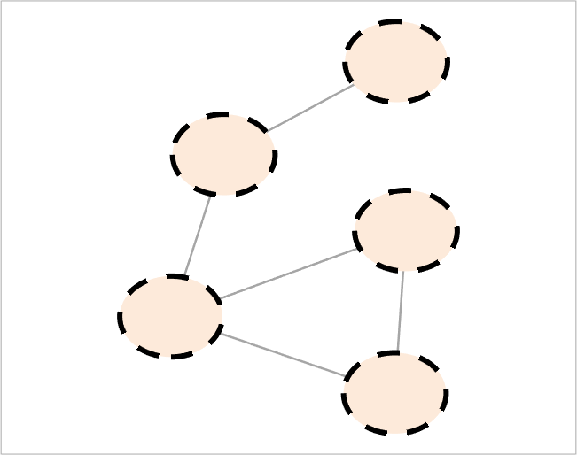
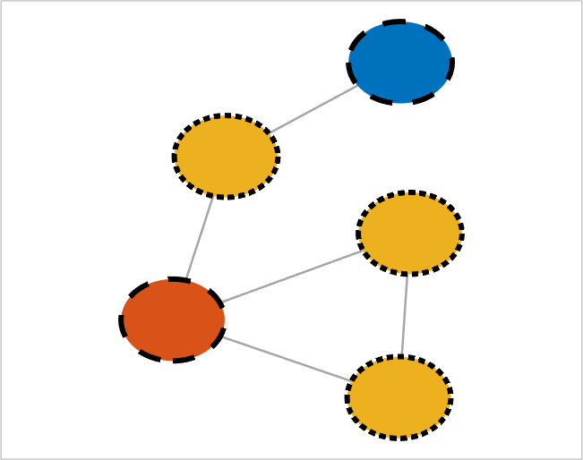

## setNodeLineStyle (networkvisualizer)
Set the line style of nodes for a given networkvisualizer object.

### Syntax
```Matlab
net = setNodeLineStyle(net, style)
net = setNodeLineStyle(net, values)
net = setNodeLineStyle(net, values, categories)
net = setNodeLineStyle(net, values, categories, classname)
```

### Arguments
* ```net```: Networkvisualizer object created with function [networkvisualizer](networkvisualizer.md).
* ```style```: A scalar value specifying the line style of all nodes.
* ```values```: A scalar value or a cell array containing the node line style to be set.
* ```categories```: A vector specifying the class categories which the modifications will apply.
* ```classname```: A string that specifies which node class the given ```categories``` correspond to.

### Description
* ```net = setNodeLineStyle(net, style)``` sets the line style of all node to ```k```.
* ```net = setNodeLineStyle(net, values)``` sets the line style of every node ```i``` to the line style provided in ```values{i}```. Thus, the ```values``` should be a vector of length equal to the number of nodes. 
* ```net = setNodeLineStyle(net, values, categories)``` uses the node class categories in ```categories``` to specify which nodes to be modified. For example, ```setNodeLineStyle(net, {'--', ':'}, {'A', 'B'})``` sets the line style of nodes with category ```'A'``` to ```--``` and nodes with category ```'B'``` to ```:```. This type of specification allows conditional formatting of nodes with respect to the categories provided. By default, it is assumed that the categories correspond to the first node class added by the [addNodeClass](addNodeClass.md) function.
* ```net = setNodeLineStyle(net, values, categories, classname)``` uses the node class with name ```classname``` for the provided categories.

### Examples

#### Setting the node line styles

```Matlab
rng(1, 'twister'); % For reproducibility
W = [0 1 1 0 0;1 0 0 1 1;1 0 0 0 0;0 0 0 0 1;1 0 1 0 0];
net = networkvisualizer(W);
net.setNodeLineWidth(3);
net.setNodeLineStyle('--');
plot(net);
```
which produces:



#### Updating node line styles using classes

```Matlab
categories = {'M', 'L', 'K', 'M', 'M'}';
net.addNodeClass(categories);
net.setNodeLineStyle(':', 'M');
plot(net);
```
which produces:



### See Also
[networkvisualizer](networkvisualizer.md), [addNodeClass](addNodeClass.md), [setNodeLabels](setNodeLabels.md), [setNodeLineColor](setNodeLineColor.md), [setNodeLineWidth](setNodeLineWidth.md)


