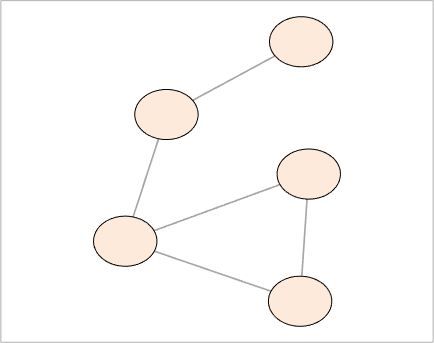
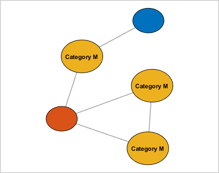

## setNodeSizes (networkvisualizer)
Set the node sizes of a networkvisualizer object.

### Syntax
```Matlab
net = setNodeSizes(net, k)
net = setNodeSizes(net, 'auto')
net = setNodeSizes(net, 'manual')
net = setNodeSizes(net, values)
net = setNodeSizes(net, values, categories)
net = setNodeSizes(net, values, categories, classname)
```

### Arguments
* ```net```: Networkvisualizer object created with function [networkvisualizer](networkvisualizer.md).
* ```k```: A scalar value specifying the size of all nodes.
* ```values```: A scalar value or a cell array containing the node sizes to be set.
* ```categories```: A vector specifying the class categories which the modifications will apply.
* ```classname```: A string that specifies which node class the given ```categories``` correspond to.

### Description
* ```net = setNodeSizes(net, k)``` sets the size of all node to ```k```.
* ```net = setNodeSizes(net, 'auto')``` enables automatic resizing to accomodate node labels. 
* ```net = setNodeSizes(net, 'manual')``` disables automatic resizing to accomodate node labels. 
* ```net = setNodeSizes(net, values)``` sets the node sizes of every node ```i``` to the size provided in ```values{i}```. Thus, the ```values``` should be a vector of length equal to the number of nodes. 
* ```net = setNodeSizes(net, values, categories)``` uses the node class categories in ```categories``` to specify which nodes to be resized. For example, ```setNodeSizes(net, {10, 12}, {'A', 'B'})``` sets the sizes of nodes with category ```'A'``` to ```10``` and nodes with category ```'B'``` to ```12```. This type of specification allows conditional formatting of nodes with respect to the categories provided. By default, it is assumed that the categories correspond to the first node class added by the [addNodeClass](addNodeClass.md) function.
* ```net = setNodeSizes(net, values, categories, classname)``` uses the node class with name ```classname``` for the provided categories.

### Examples

#### Setting the node sizes

```Matlab
rng(1, 'twister'); % For reproducibility
W = [0 1 1 0 0;1 0 0 1 1;1 0 0 0 0;0 0 0 0 1;1 0 1 0 0];
net = networkvisualizer(W);
net = setNodeSizes(net, 15);
plot(net);
```
which produces:



#### Updating node sizes using classes

```Matlab
categories = {'M', 'L', 'K', 'M', 'M'}';
net = addNodeClass(net, categories);
net = setNodeLabels(net, {'Category M'}, 'M');
net = setNodeSizes(net, 20, 'M');
plot(net);
```
which produces:



### See Also
[networkvisualizer](networkvisualizer.md), [addNodeClass](addNodeClass.md), [setNodeLabels](setNodeLabels.md), [setNodeFontSize](setNodeFontSize.md)


